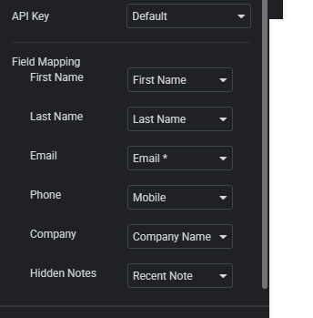

# Elementor Freshsales

Create a **Freshsales CRM lead** from every **Elementor Pro** form submission — with a clean,
form-first field-mapping UI. Built by **Cornerstone**.

- No external libraries · vanilla JS/CSS
- Strict security (domain allowlist, safe HTTP, nonces, capability checks, escaping)
- Resilient: a temporary Freshsales outage never breaks the visitor's form
- Clean uninstall — no data left behind

*Form-first field mapping: your form fields on the left, Freshsales fields on the right.*

## Requirements

- **WordPress** 6.0 or newer
- **PHP** 7.4 or newer
- **Elementor** (free) — the page builder
- **Elementor Pro** — specifically the **Forms** widget (Pro-only), which provides the submit-action
  framework this plugin hooks into. The plugin does nothing without it and shows an admin notice if it's
  missing.
- A **Freshsales** account with:
  - your account **domain** (e.g. `yourcompany.freshsales.io`)
  - an **API key** (Freshsales → Profile Settings → API Settings)

## Install

1. Copy the `elementor-freshsales` folder to `wp-content/plugins/`.
2. Activate **Elementor Freshsales** in **Plugins**.

## Configure

1. **Elementor → Settings → Integrations → Freshsales**: enter your **Domain** and **API Key**, save,
   then click **Validate Connection**.
2. Edit a page with an **Elementor Form** → **Actions After Submit** → add **Freshsales**.
3. In the **Freshsales** section, map each of your form fields to a Freshsales field.

See **[docs/USAGE.md](docs/USAGE.md)** for the full walkthrough.

## Field mapping

The mapping is **form-first**: each of your form's fields is listed on the left with a Freshsales-field
dropdown on the right (the inverse of Elementor's default). Dropdown options are grouped by section:

| Group | Options |
|-------|---------|
| Contact | First Name, Last Name, Email\*, Mobile\* |
| Company | Company Name |
| Source information | Medium, Keyword |
| Notes | Recent Note (activity note), Notes (custom field) |

\* Freshsales requires at least one of Email or Mobile. The **Source** is set automatically to **"Web Form."**

Adding more fields is a one-line change — see **[docs/FIELD-MAPPING.md](docs/FIELD-MAPPING.md)**.

## Screenshots

The field-mapping panel is shown above. Additional editor screenshots can be added to `docs/images/`.

## Documentation

| Doc | What's in it |
|-----|--------------|
| [docs/USAGE.md](docs/USAGE.md) | End-to-end setup and troubleshooting |
| [docs/ARCHITECTURE.md](docs/ARCHITECTURE.md) | Files, hooks, load order, data flow |
| [docs/FIELD-MAPPING.md](docs/FIELD-MAPPING.md) | The field list, groups, and how to add fields |
| [docs/FRESHSALES-API.md](docs/FRESHSALES-API.md) | Every Freshsales endpoint/payload used |
| [docs/SECURITY.md](docs/SECURITY.md) | The security model and rules |
| [docs/DEVELOPMENT.md](docs/DEVELOPMENT.md) | Local setup, testing, versioning |

## Uninstall

Deleting the plugin runs `uninstall.php`, which removes its options and cached transients (multisite-aware).
Nothing is left behind.

## License

GPL-2.0-or-later.
